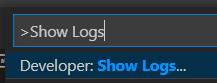
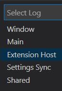

## Package
```
vsce package
```
It generates a `tgde-${version}.vsix` file which contains all of the project files.

## Dev Install
Drag this file to VS Code extension UI to install it.

VS Code extensions are installed under `~/.vscode/extensions`.

## Debug
#### Extension Logs
`Ctrl` + `Shift` + `P` to open command panel.


Type `Show Logs` and choose `Extension Host`


You will see extension logs in `OUTPUT` at the bottom.
## Publish
